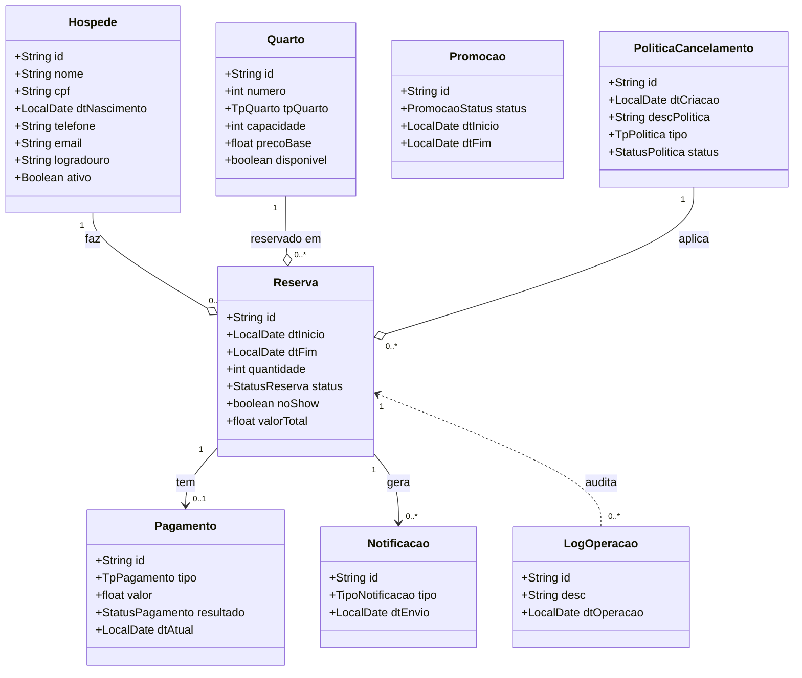

# Diagrama de Domínio
- Tipos de dados como "TpQuarto" e "StatusReserva" são ENUMs

```mermaid
classDiagram
direction TB

%% ============================
%% Entidades Principais
%% ============================

class Hospede {
  +String id
  +String nome
  +String cpf
  +LocalDate dtNascimento
  +String telefone
  +String email
  +String logradouro
  +Boolean ativo
}

class Quarto {
  +String id
  +int numero
  +TpQuarto tpQuarto
  +int capacidade
  +float precoBase
  +boolean disponivel
}

class Promocao {
  +String id
  +PromocaoStatus status
  +LocalDate dtInicio
  +LocalDate dtFim
}

class PoliticaCancelamento {
  +String id
  +LocalDate dtCriacao
  +String descPolitica
  +TpPolitica tipo
  +StatusPolitica status
}

class Reserva {
  +String id
  +LocalDate dtInicio
  +LocalDate dtFim
  +int quantidade
  +StatusReserva status
  +boolean noShow
  +float valorTotal
}

class Pagamento {
  +String id
  +TpPagamento tipo
  +float valor
  +StatusPagamento resultado
  +LocalDate dtAtual
}

class Notificacao {
  +String id
  +TipoNotificacao tipo
  +LocalDate dtEnvio
}

class LogOperacao {
  +String id
  +String desc
  +LocalDate dtOperacao
}

%% ============================
%% RELACIONAMENTOS
%% ============================

Hospede "1" --o "0..*" Reserva : faz
Quarto "1" --o "0..*" Reserva : reservado em
Reserva "1" --> "0..1" Pagamento : tem
Reserva "1" --> "0..*" Notificacao : gera
Reserva "1" <.. "0..*" LogOperacao : audita

PoliticaCancelamento "1" --o "0..*" Reserva : aplica


```
