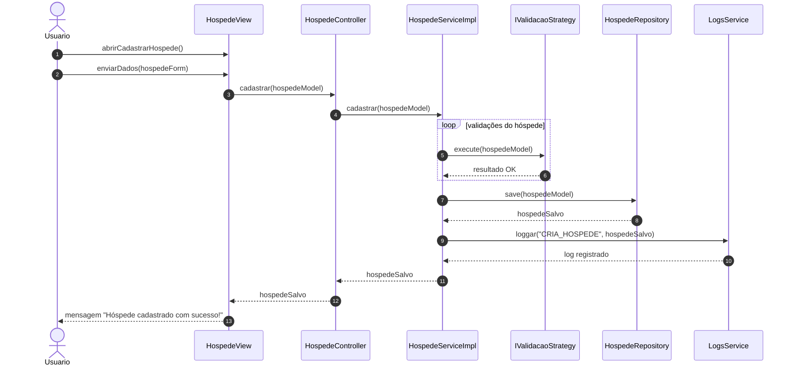

# Cadastrar Hospedede

```mermaid
sequenceDiagram
    autonumber

    actor Usuario
    participant HospedeView
    participant HospedeController
    participant HospedeServiceImpl
    participant IValidacaoStrategy
    participant HospedeRepository
    participant LogsService

    Usuario ->> HospedeView: abrirCadastrarHospede()
    Usuario ->> HospedeView: enviarDados(hospedeForm)

    HospedeView ->> HospedeController: cadastrar(hospedeModel)

    HospedeController ->> HospedeServiceImpl: cadastrar(hospedeModel)

    %% LOOP DAS VALIDAÇÕES
    loop validações do hóspede
        HospedeServiceImpl ->> IValidacaoStrategy: execute(hospedeModel)
        IValidacaoStrategy -->> HospedeServiceImpl: resultado OK
    end

    %% PERSISTÊNCIA
    HospedeServiceImpl ->> HospedeRepository: save(hospedeModel)
    HospedeRepository -->> HospedeServiceImpl: hospedeSalvo

    %% LOGS DO SISTEMA (RNF0131)
    HospedeServiceImpl ->> LogsService: loggar("CRIA_HOSPEDE", hospedeSalvo)
    LogsService -->> HospedeServiceImpl: log registrado

    %% RETORNO PARA CAMADAS SUPERIORES
    HospedeServiceImpl -->> HospedeController: hospedeSalvo
    HospedeController -->> HospedeView: hospedeSalvo
    HospedeView -->> Usuario: mensagem "Hóspede cadastrado com sucesso!"


```
