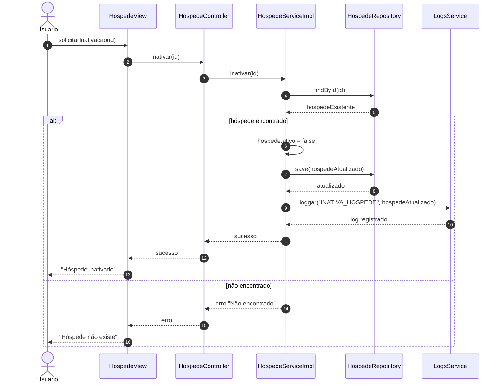

# Inativar Hospedede

```mermaid
sequenceDiagram
    autonumber

    actor Usuario
    participant HospedeView
    participant HospedeController
    participant HospedeServiceImpl
    participant HospedeRepository
    participant LogsService

    Usuario ->> HospedeView: solicitarInativacao(id)
    HospedeView ->> HospedeController: inativar(id)

    HospedeController ->> HospedeServiceImpl: inativar(id)

    HospedeServiceImpl ->> HospedeRepository: findById(id)
    HospedeRepository -->> HospedeServiceImpl: hospedeExistente

    alt hóspede encontrado
        HospedeServiceImpl ->> HospedeServiceImpl: hospede.ativo = false
        HospedeServiceImpl ->> HospedeRepository: save(hospedeAtualizado)
        HospedeRepository -->> HospedeServiceImpl: atualizado

        HospedeServiceImpl ->> LogsService: loggar("INATIVA_HOSPEDE", hospedeAtualizado)
        LogsService -->> HospedeServiceImpl: log registrado

        HospedeServiceImpl -->> HospedeController: sucesso
        HospedeController -->> HospedeView: sucesso
        HospedeView -->> Usuario: "Hóspede inativado"
    else não encontrado
        HospedeServiceImpl -->> HospedeController: erro "Não encontrado"
        HospedeController -->> HospedeView: erro
        HospedeView -->> Usuario: "Hóspede não existe"
    end


```
