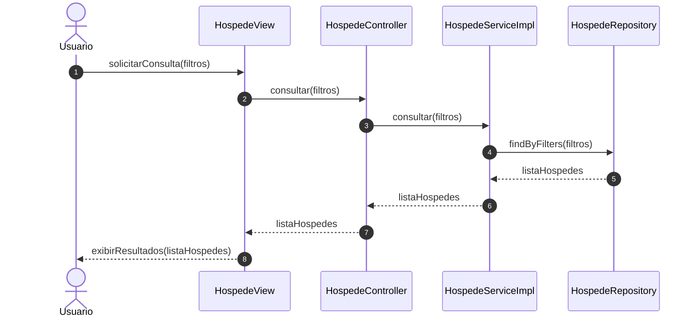

# Consultar Hospedede

```mermaid
sequenceDiagram
    autonumber

    actor Usuario
    participant HospedeView
    participant HospedeController
    participant HospedeServiceImpl
    participant HospedeRepository

    Usuario ->> HospedeView: solicitarConsulta(filtros)
    HospedeView ->> HospedeController: consultar(filtros)

    HospedeController ->> HospedeServiceImpl: consultar(filtros)

    HospedeServiceImpl ->> HospedeRepository: findByFilters(filtros)
    HospedeRepository -->> HospedeServiceImpl: listaHospedes

    HospedeServiceImpl -->> HospedeController: listaHospedes
    HospedeController -->> HospedeView: listaHospedes
    HospedeView -->> Usuario: exibirResultados(listaHospedes)

```
