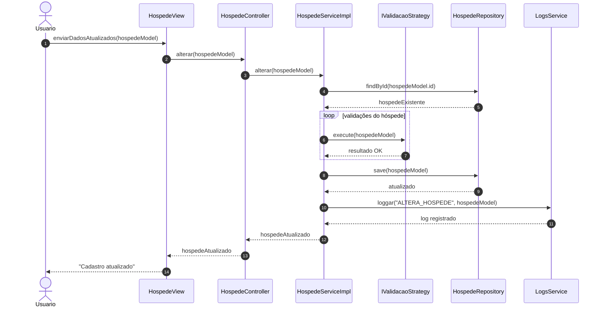

# Atualizar Hospedede

```mermaid
sequenceDiagram
    autonumber

    actor Usuario
    participant HospedeView
    participant HospedeController
    participant HospedeServiceImpl
    participant IValidacaoStrategy
    participant HospedeRepository
    participant LogsService

    Usuario ->> HospedeView: enviarDadosAtualizados(hospedeModel)
    HospedeView ->> HospedeController: alterar(hospedeModel)

    HospedeController ->> HospedeServiceImpl: alterar(hospedeModel)

    %% Buscar hóspede atual
    HospedeServiceImpl ->> HospedeRepository: findById(hospedeModel.id)
    HospedeRepository -->> HospedeServiceImpl: hospedeExistente

    %% LOOP DAS VALIDAÇÕES (mesmas do cadastro)
    loop validações do hóspede
        HospedeServiceImpl ->> IValidacaoStrategy: execute(hospedeModel)
        IValidacaoStrategy -->> HospedeServiceImpl: resultado OK
    end

    %% Atualização
    HospedeServiceImpl ->> HospedeRepository: save(hospedeModel)
    HospedeRepository -->> HospedeServiceImpl: atualizado

    %% LOG (RNF0131)
    HospedeServiceImpl ->> LogsService: loggar("ALTERA_HOSPEDE", hospedeModel)
    LogsService -->> HospedeServiceImpl: log registrado

    HospedeServiceImpl -->> HospedeController: hospedeAtualizado
    HospedeController -->> HospedeView: hospedeAtualizado
    HospedeView -->> Usuario: "Cadastro atualizado"

```
